# Kalkulator : Predictive Analysis for Academic Performance using Linear, Ridge and Lasso Regression, Random Forest, XGBoost and Decision Tree

This predictive assessment project aims to evaluate learning outcomes through a comprehensive analysis of various machine learning algorithms. 
The review covers critical issues in predictive analytics, including data preprocessing, exploratory data analysis (EDA), model development, data validation, and deployment. 
The initial phase consists of careful data preprocessing to ensure data quality and accuracy. 
Subsequently, exploratory data analysis reveals meaningful insights into the relationships among the variables. Comparative analysis is performed on at least 4-5 AI/ML algorithms in the core predictive modeling phase. Successful data validation procedures are used to build predictions and emphasize the strength of the models . 
The final step is to develop a graphical user interface (GUI) that facilitates testing new data. Users can enter the context, select the desired prediction model, and see the predicted results, specifically focusing on SGPA and CGPA for the 5th grade.

Read the full Report Here : https://drive.google.com/file/d/1xOrrw3cMXNC4t39R39Mu3C1_vQ0I3PNF/view?usp=sharing 

## Critical Path and Activity Diagram:

The activity diagram represents the complete workflow of the predictive analysis project, illustrating how each stage connects to the next in a logical and sequential manner. It begins with data collection, where the raw academic dataset is gathered, followed by data preprocessing, which ensures that the dataset is clean, consistent, and ready for analysis. Once preprocessing is completed, the workflow branches into two parallel activities: Exploratory Data Analysis (EDA) and GUI development. EDA is divided into two stages, each uncovering patterns, trends, and correlations that help guide the modeling process. After EDA, the project proceeds to model training, where multiple machine learning algorithms are developed and tested. These trained models are then evaluated to determine their accuracy and predictive performance. Meanwhile, GUI development continues alongside EDA, ensuring that the system interface is ready to integrate the final models. Once evaluation and interface development are complete, the project moves into documentation, where insights, methodologies, and results are compiled. The final activity concludes with submission. Overall, the activity diagram provides a clear visualization of how different stages interact, overlap, and progress toward building a functional, deployable academic prediction system.

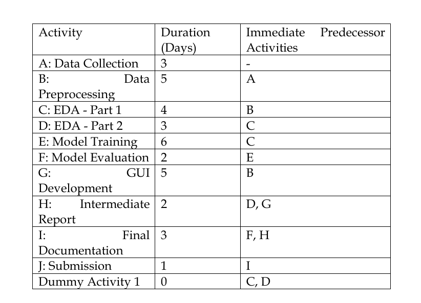

The critical path outlines the sequence of essential tasks that determine the minimum possible completion time for the project. It highlights the tasks that cannot be delayed without impacting the overall timeline. For this project, the critical path is A → B → G → C → D → E → F → I → J. It begins with data collection (A), followed immediately by data preprocessing (B), which is foundational for all downstream activities. GUI development (G) starts after preprocessing and is critical because the final deployment depends on it. The workflow then returns to EDA, starting with part one (C) and continuing to part two (D), both of which are necessary for understanding the dataset and ensuring model readiness. After the analysis, model training (E) takes place, followed by model evaluation (F), where the trained models are assessed. These results feed directly into the final documentation stage (I), which brings together all findings, methodologies, and outcomes. The project concludes with submission (J). This ordered sequence of interconnected tasks represents the longest path through the project network and therefore governs the project’s total duration. Understanding the critical path ensures efficient planning and helps identify the activities that require the most focus to prevent timeline delays.

## Work Breakdown Structure

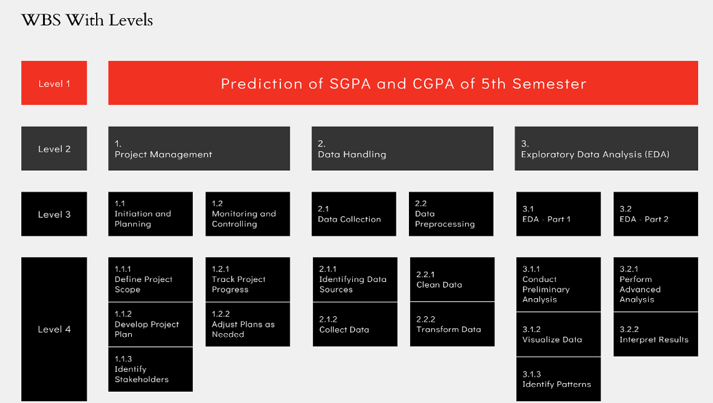

The Work Breakdown Structure (WBS) provides a hierarchical decomposition of the entire predictive analysis project, breaking it into manageable phases and well-defined tasks. It begins with the overall project objective and divides the work into major components such as data collection, data preprocessing, exploratory data analysis, model training, model evaluation, GUI development, documentation, and submission. Each of these components is further separated into smaller, actionable activities that clearly outline what needs to be accomplished at each stage. For instance, data preprocessing includes tasks such as cleaning, handling missing values, and removing duplicates, while EDA is split into multiple analytical steps to explore patterns and correlations in the data. Model development is broken into training and evaluation phases to ensure reliability and accuracy. 

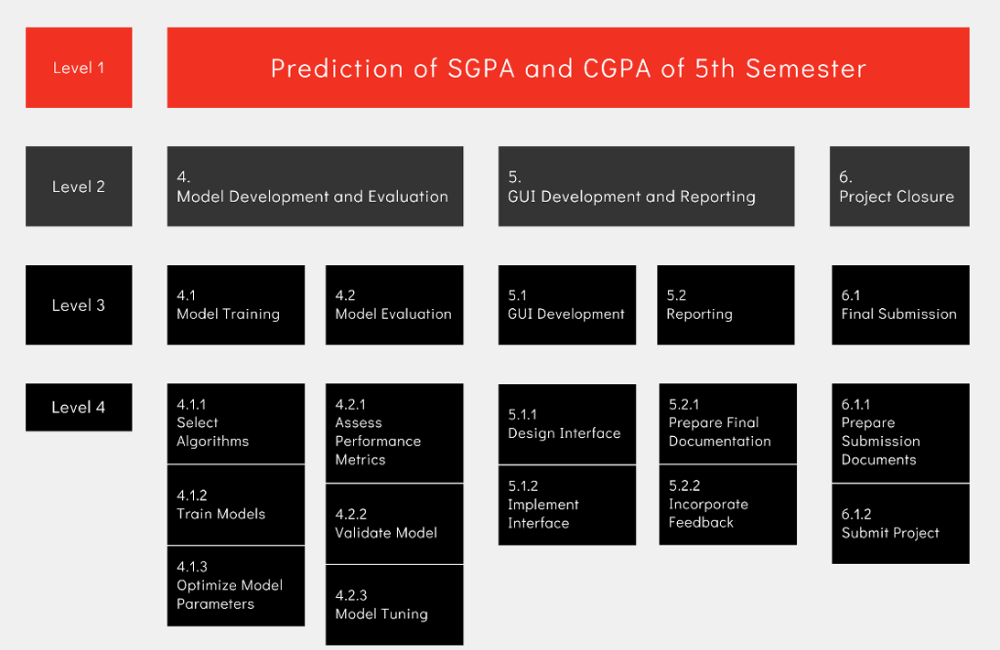

GUI development proceeds in parallel, ensuring that the user interface is ready to integrate the final models. Documentation tasks compile all project details, findings, and results before final submission. By organizing the project in this structured manner, the WBS ensures systematic planning, smooth task management, clear role allocation, and efficient time management. It also supports the identification of dependencies between tasks, enabling better scheduling and contributing to a more controlled and streamlined project workflow.

## Data Preprocessing 
Initially, data cleaning is the start of the process. Graphical techniques such as box plots or histograms were suggested to identify potential redundancies in the statistical scores. Missing values were handled. Duplicate values were removed and EDA was performed. 

The project began with a structured data collection phase in which academic performance records were gathered and compiled into a single dataset. Once the data source was finalized, the dataset was imported into the Python environment using Pandas, a reliable library for data manipulation. During the import process, the dataset was inspected for formatting issues, irregular column names, inconsistent spacing, and hidden characters that could interfere with further processing. This ensured that the dataset was loaded cleanly and ready for analysis without structural errors.

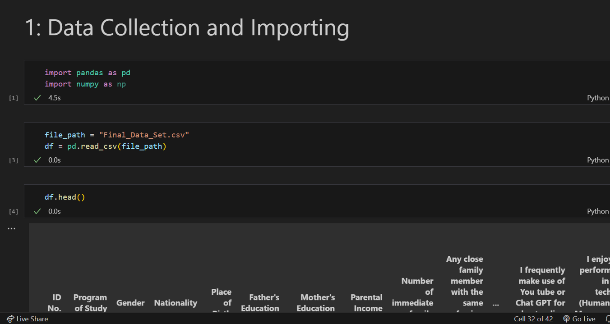
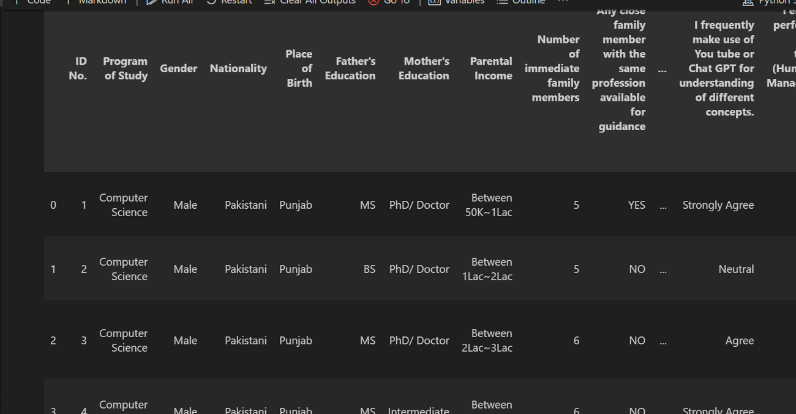
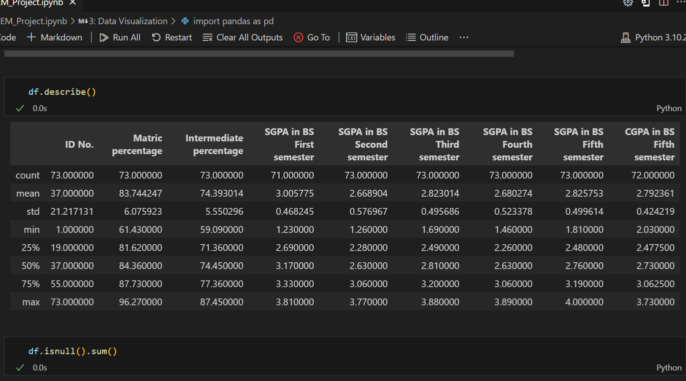

After importing the dataset, a thorough inspection was conducted to identify missing or incomplete values. Missing data can significantly distort model training and lead to unreliable predictions, so each column was examined using summary statistics and Pandas functions such as isnull() and info(). Fortunately, the dataset did not contain missing values in the selected features, meaning no additional imputation or data-filling techniques were required. Verifying the absence of missing values ensured that the dataset maintained its integrity and that each record provided a complete representation of a student’s academic performance.

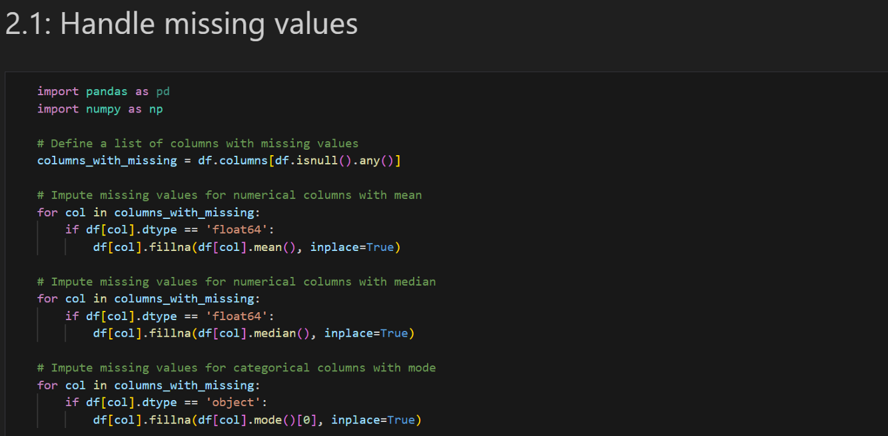

Duplicate entries can bias the statistical distribution of the dataset and mislead the model into learning repetitive patterns. To prevent this, the dataset was scanned for identical rows using the duplicated() function. Any repeated entries found were removed, ensuring that each student appeared only once in the dataset. Eliminating duplicates not only protected the validity of the analysis but also enhanced the accuracy of the predictive models by preventing overrepresentation of certain records.

Outliers extreme or unusual values,can have a substantial impact on model performance, especially in regression-based tasks. Visual techniques such as boxplots and histograms were used to examine the distribution of numerical features and identify potential outliers. Instead of arbitrarily removing extreme values, the decision to keep or adjust an outlier was guided by domain knowledge, the context of academic scoring, and the robustness of the chosen machine learning models. This careful approach ensured that the dataset maintained realistic academic variations while preventing rare values from disproportionately influencing model predictions.
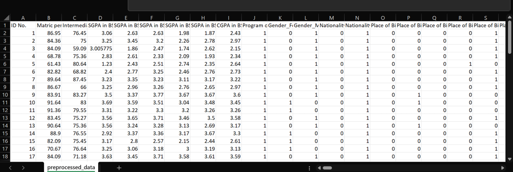

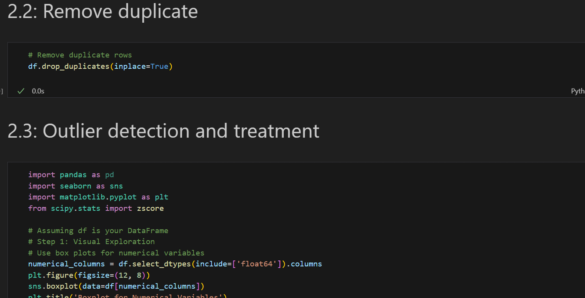

## Predictive Models 

A wide range of machine learning models was trained and evaluated to determine their suitability for predicting SGPA and CGPA. Linear Regression was used as the baseline model, establishing a simple linear relationship between features and the target values. Ridge Regression improved upon this by adding L2 regularization, reducing overfitting, and handling multicollinearity effectively. Lasso Regression introduced L1 regularization, which encouraged sparsity by shrinking some coefficients to zero, functioning as both a predictor and a feature selector. ElasticNet combined the penalties of Ridge and Lasso, balancing their strengths to handle correlated and high-dimensional data.

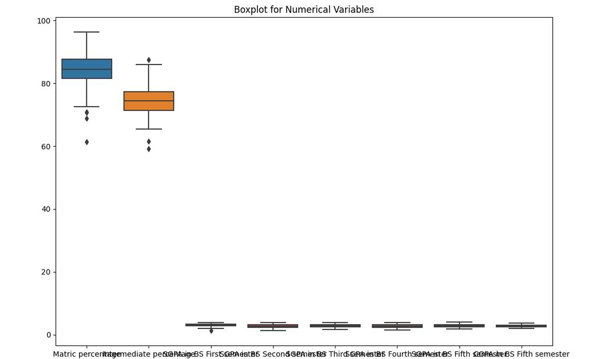

Tree-based and ensemble methods were also explored. Random Forest constructed multiple decision trees and averaged their predictions, resulting in a robust and reliable model that captured complex patterns within the data. Gradient Boosting built trees sequentially, with each tree minimizing the errors of the previous one, ultimately producing high predictive accuracy. XGBoost enhanced gradient boosting with optimized pruning and regularization, offering excellent speed and performance. LightGBM provided further efficiency improvements through its leaf-wise tree growth strategy, making it particularly effective for fast training. A standalone Decision Tree model was also implemented for its interpretability and logical splitting of academic performance indicators.

Hybrid models were developed to extend the predictive capacity of individual algorithms. The stacked model combined predictions from several base learners and trained an additional meta-model to refine the final output, improving accuracy by leveraging the strengths of multiple algorithms. The parallel ensemble model executed several models simultaneously and aggregated their results, benefiting from robust joint predictions and reduced variance. Together, these models provided a comprehensive comparison framework and demonstrated different behaviors in terms of predictive accuracy and generalizability.

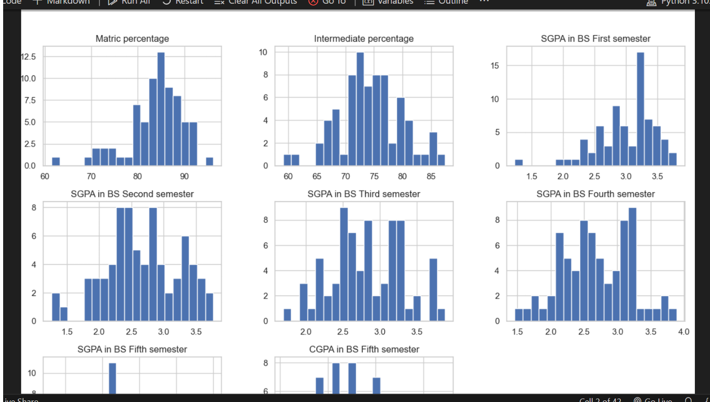

1. Linear Regression

A simple and widely used regression algorithm that models a straight-line relationship between features and target values. It minimizes the difference between predicted and actual values to find the best-fit line.

RMSE: SGPA = 0.14, CGPA = 0.07

2. Ridge Regression

A linear regression model with L2 regularization. It adds a penalty term to shrink large coefficients, reduce overfitting, and handle multicollinearity.
RMSE: SGPA = 0.13, CGPA = 0.07

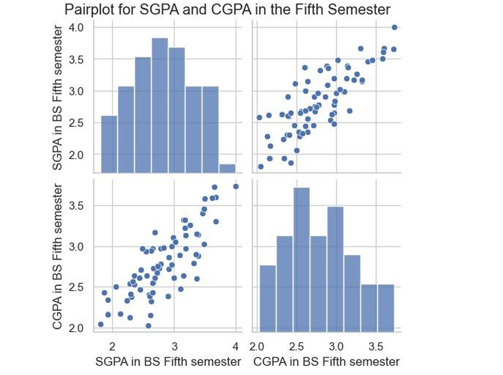

3. Lasso Regression

Linear Regression with L1 regularization. Lasso pushes some coefficients to zero, performing both prediction and feature selection, especially useful in high-dimensional datasets.

RMSE: SGPA = 0.23, CGPA = 0.27

4. ElasticNet Regression

Combines L1 (Lasso) and L2 (Ridge) penalties. Effective for correlated features and situations where neither Lasso nor Ridge alone performs well.
RMSE: SGPA = 0.23, CGPA = 0.27

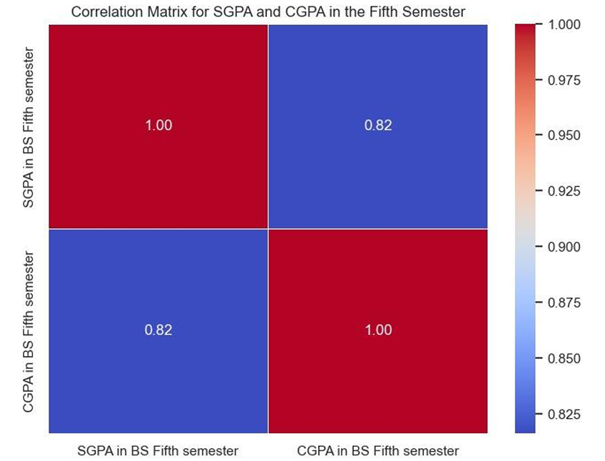

5. Random Forest

An ensemble model that constructs many decision trees and averages their predictions. It improves accuracy, reduces overfitting, and identifies important features.
RMSE: SGPA = 0.16, CGPA = 0.08

6. Gradient Boosting
Builds trees sequentially, with each new tree correcting the errors of the previous one. It provides high predictive accuracy and is widely used in structured data problems.
RMSE: SGPA = 0.18, CGPA = 0.09

7. XGBoost

An optimized, faster, and more accurate version of gradient boosting. Features pruning, regularization, and parallel processing—making it a leading choice in ML competitions.
RMSE: SGPA = 0.19, CGPA = 0.11

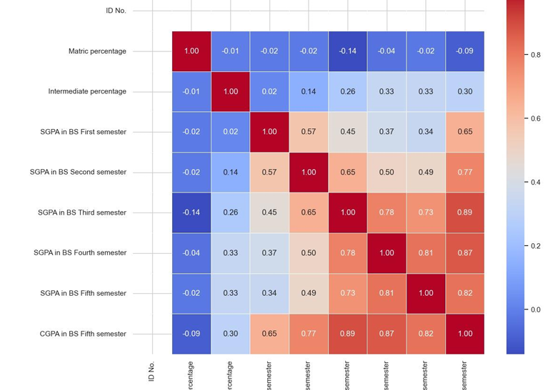

8. LightGBM

A gradient boosting framework optimized for speed and efficiency. Uses leaf-wise tree growth, making it faster and more scalable than many other boosting algorithms.
RMSE: SGPA = 0.16, CGPA = 0.11

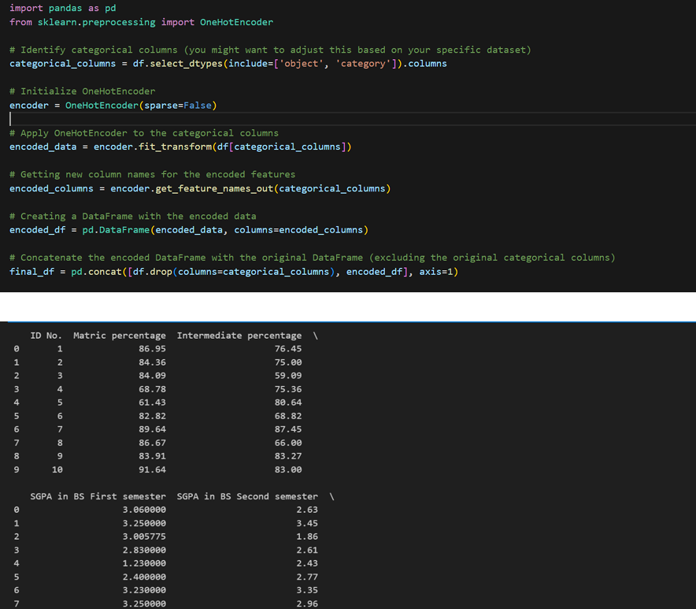

9. Decision Tree

A simple, interpretable model that splits data into smaller subsets based on decision rules. Useful for understanding how individual features contribute to predictions.
RMSE: SGPA = 0.20, CGPA = 0.11

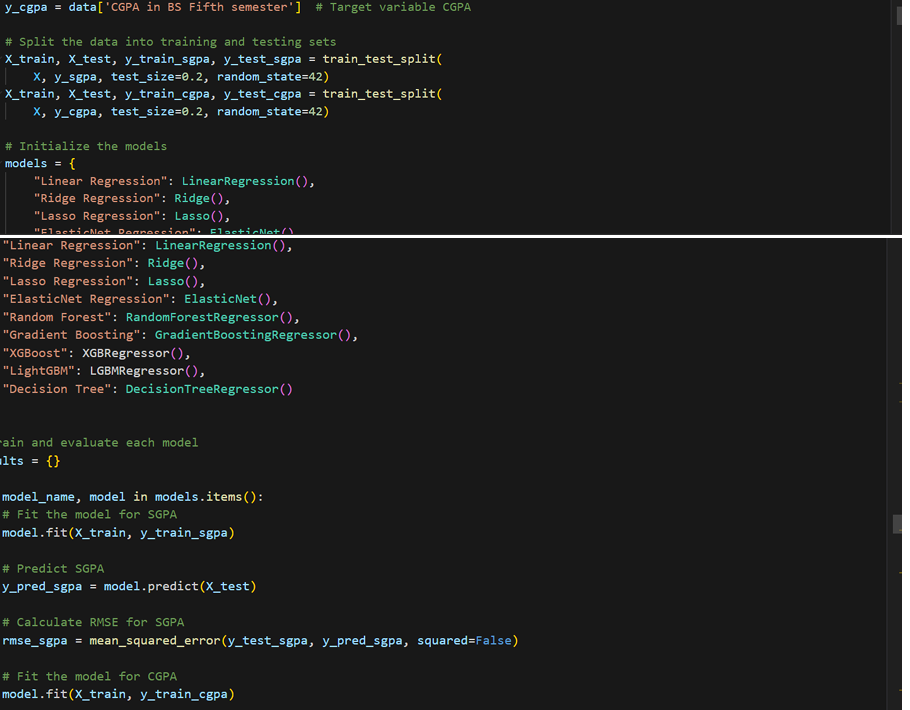

10. Hybrid Model

### Stacked Model

Combines predictions from multiple base models and trains a meta-model to produce final predictions. Captures strengths of different learners and improves accuracy.
RMSE: SGPA = 0.15, CGPA = 0.07

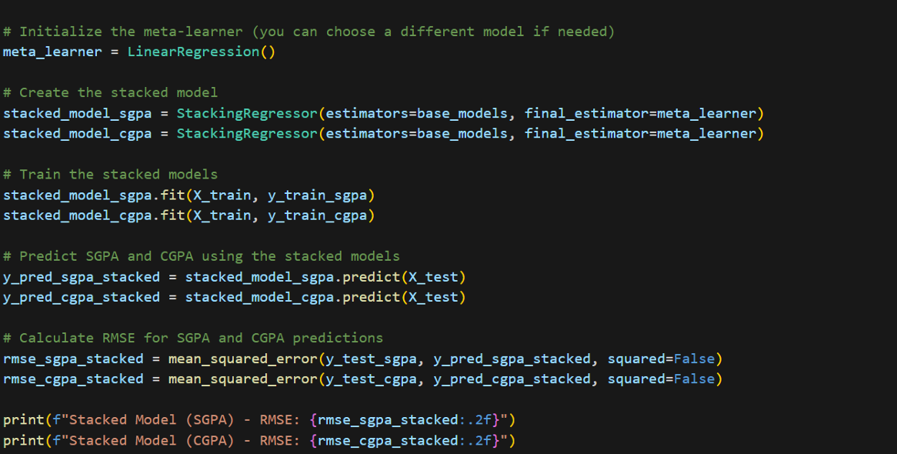

### Parallel Ensemble Model

Runs multiple models simultaneously and aggregates their outputs. Offers speed, robustness, and improved performance in batch prediction scenarios.
RMSE: SGPA = 0.15, CGPA = 0.11

### Deployment

The trained models were deployed using Streamlit, enabling rapid development of an interactive prediction interface. Streamlit displays the models, accepts new inputs, and shows SGPA/CGPA predictions instantly.

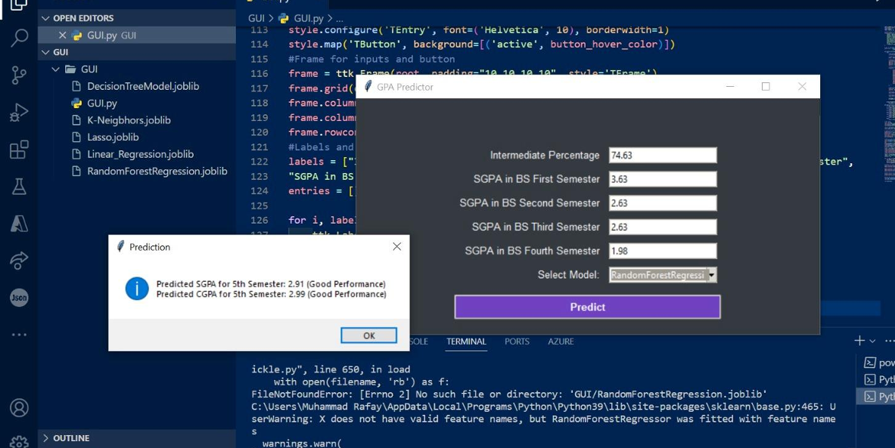
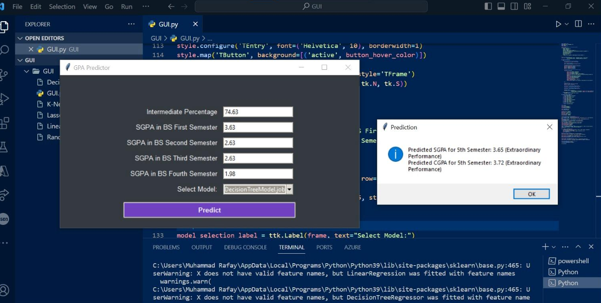
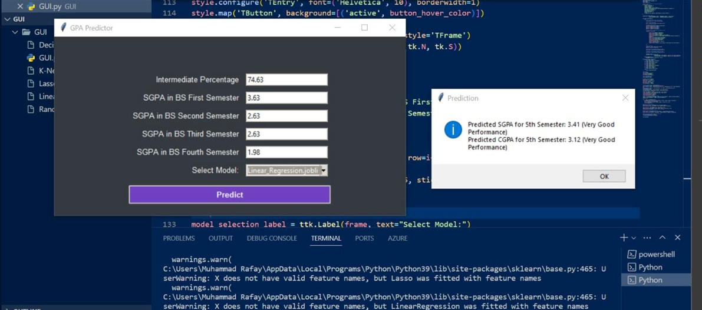
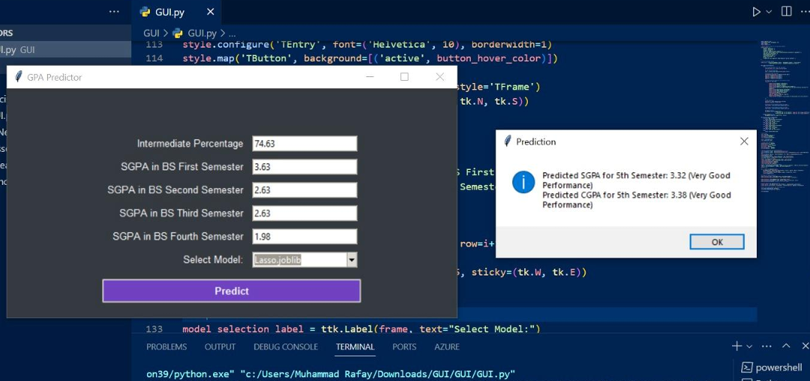
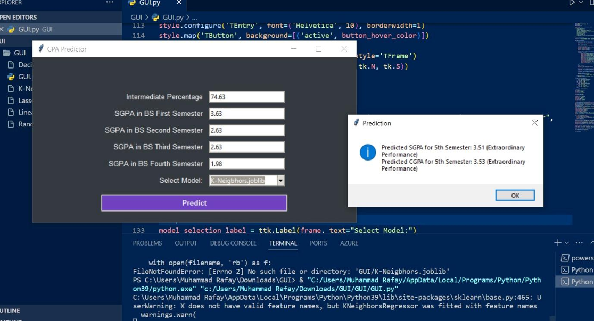

### My Contribution

I was responsible for training and evaluating all machine learning models, running comparative analysis, tuning selected models, and preparing the final trained models integrated into the GUI.

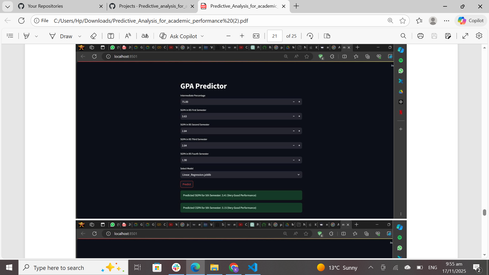
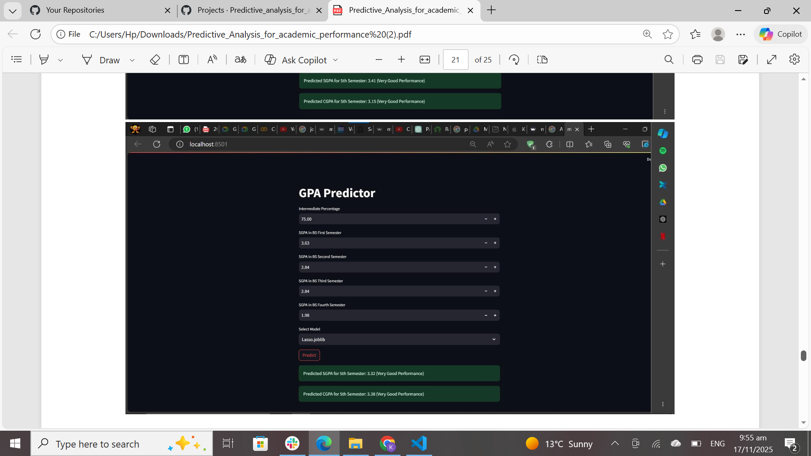
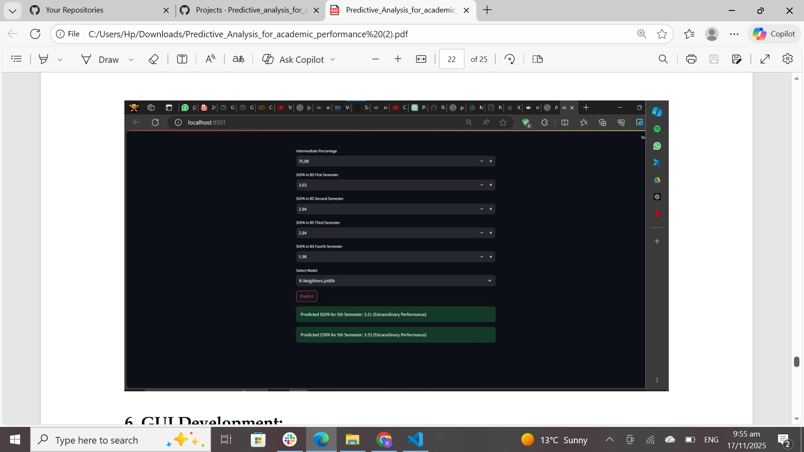

### Conclusion

This project applied a systematic data science pipeline to predict student academic performance. Through rigorous preprocessing, EDA, and model comparison, the study identified strong predictors of SGPA and CGPA and demonstrated the strengths and limitations of various ML approaches. Ensemble models such as Random Forest and Gradient Boosting performed competitively, while linear models like Ridge achieved strong accuracy with lower error. The GUI and deployment make the system practical for real-world academic prediction scenarios. Overall, this work contributes meaningful insights into academic analytics and highlights the value of predictive modeling in supporting student success.

